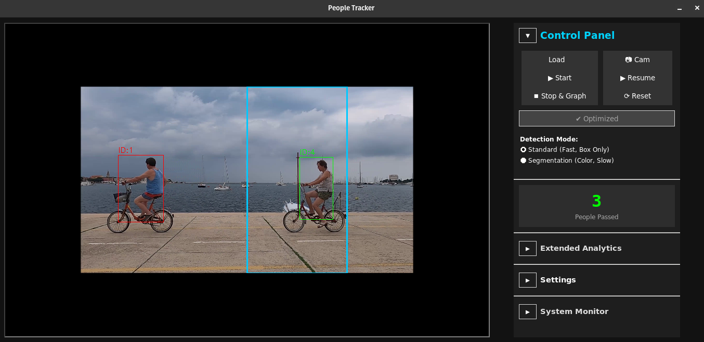
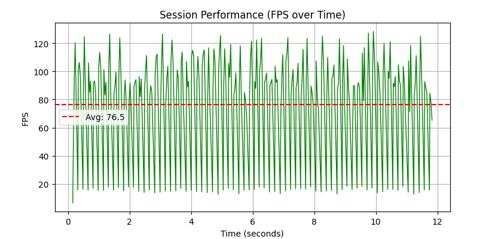

# Computer Vision: People counter project

This project implements an advanced computer vision system for monitoring and analyzing pedestrian movement within a defined Region of Interest (ROI). It balances high analytical precision with performance optimization, designed to run smoothly on standard CPU hardware.

## Project goal

### Core requirements
* **Unique Person Counting:** Accurately count non-repeating individuals who cross a defined counting line/region.
* **Real-Time Performance:** Maintain fluid video playback and processing speed on consumer-grade hardware (Intel Core i3/i5) without dedicated GPUs.

### Implementation level
* **Low-Level Implementation:** Achieved through custom tracking logic (IoU matching, motion vectors) and **Pure Math** image processing (NumPy-based mask erosion) instead of heavy external libraries.

---

## Application features

### 1. Interface & Monitoring
The application features a modern GUI with real-time analytics, system monitoring, and collapsible control panels.


*Figure 1: Main application window showing active tracking, segmentation, and control panel.*

### 2. Advanced tracking & counting
* **Dual Detection Modes:**
    * **Standard Mode:** Uses `yolov8n` (bounding boxes) for maximum speed.
    * **Segmentation Mode:** Uses `yolov8n-seg` for precise pixel-level analysis.
* **Unique Pass Counting:** Implements logic to count a person only once when they traverse the central zone.
* **Occlusion Resistance:** Uses trajectory prediction to maintain IDs during brief obstructions.

### 3. Statistical analysis
The application calculates real-time metrics for tracked individuals:
* **Average Speed (px/s):** Estimates movement speed based on frame displacement.
* **Dwell Time:** Measures how long individuals stay within the ROI.
* **Smart Color Detection ("First Sight Lock"):** Identifies clothing color using semantic segmentation. It analyzes the color **only once** (upon first reliable detection) and locks the result to save CPU resources.

### 4. Performance Engineering
* **Pure Math Processing:** Replaces OpenCV morphological operations with raw **NumPy** matrix manipulations for mask erosion.
* **OpenVINO™ Integration:** Built-in optimizer to boost inference speed on Intel CPUs.
* **Real-Time Sync:** Automatically adjusts processing intervals (sleep/skip) to match the video's native framerate (e.g., 25 FPS).


*Figure 2: Post-session performance report showing FPS stability over time.*

## How to Run

1.  **Install dependencies:**
    ```bash
    pip install -r requirements.txt
    ```
    Note: `tkinter` is part of the Python standard library and is provided by your OS, not via `pip`. If you see "No matching distribution found for tkinter", install the OS package:
    - Debian/Ubuntu: `sudo apt install python3-tk`
    - Fedora: `sudo dnf install python3-tkinter`
    - Arch Linux: `sudo pacman -S tk`

    Optional verification after installation:
    ```bash
    python -c "import tkinter as tk; print('Tk version:', tk.TkVersion)"
    ```
2.  **Run the application:**
    ```bash
    python tracker_v2.py
    ```